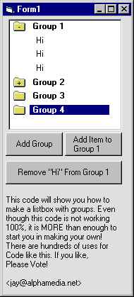



## ORGANIZE YOUR LISTBOXES INTO GRUPS\!

### Description

This will show you how to make groups in your listboxes with this simple control. Since it is not yet 100% functional (it's about 95%), there is a lot of roomfor personal customization. This control is yours for the taking. Download it and add / remove any features you want.
 
### More Info
 

             |
---                |---
**Submitted On**   |2000-08-07 12:28:38
**By**             |[Sparq](https://github.com/Planet-Source-Code/PSCIndex/blob/master/ByAuthor/sparq.md)
**Level**          |Intermediate
**User Rating**    |5.0 (10 globes from 2 users)
**Compatibility**  |VB 6\.0
**Category**       |[Custom Controls/ Forms/  Menus](https://github.com/Planet-Source-Code/PSCIndex/blob/master/ByCategory/custom-controls-forms-menus__1-4.md)
**World**          |[Visual Basic](https://github.com/Planet-Source-Code/PSCIndex/blob/master/ByWorld/visual-basic.md)
**Archive File**   |[CODE\_UPLOAD8702872000\.zip](https://github.com/Planet-Source-Code/sparq-organize-your-listboxes-into-grups__1-10478/archive/master.zip)

